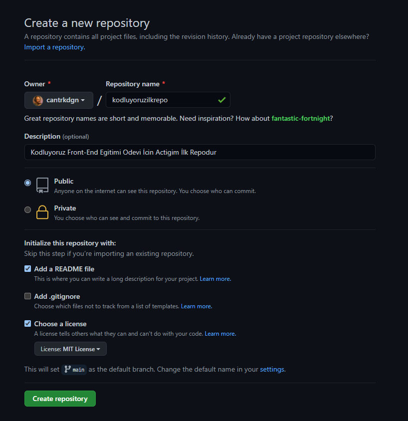

# Kodluyoruz Ilk Repo
[Kodluyoruz](https://www.kodluyoruz.org/) Front-End Egitimi Odevi İcin Actigim İlk Repodur. İcerisinde ornek bir index.html dosyasi ve readme dosyasi barindirmaktadir.



## Installation
---

Öncelikle projeyi clonelayın.
```
git clone https://github.com/cantrkdgn/kodluyoruzilkrepo.git
```
## Usage
---
Projeyi cloneladıktan sonra Visual Studio Code programında açınız.

Linux için:
```
cd kodluyoruzilkrepo
code .
```
## Contributing
---
Pull requestler kabul edilir. Büyük değişiklikler için, lütfen önce neyi değiştirmek istediğinizi tartışmak için bir konu açınız.

## License
---
[MIT](https://choosealicense.com/licenses/mit/)
